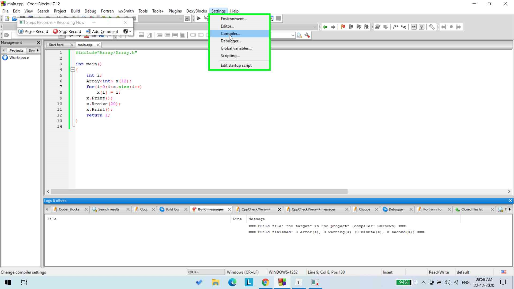
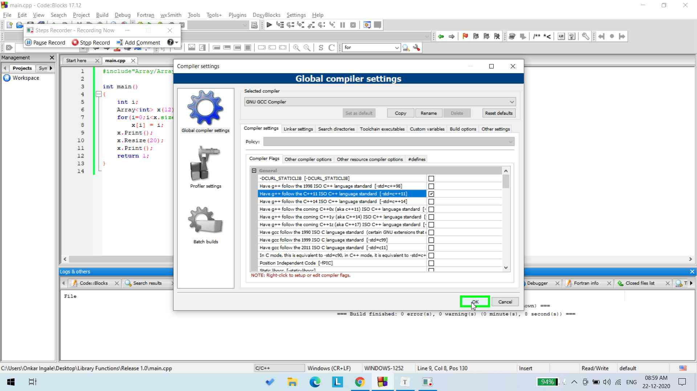

## Coding Guidelines:

------


### Do Not Define Overloading Operator Outside the Class :


> #### Note:
>
> ⚠ **Please, Define the Overloading Operator within the Class.**

*It's not an issue for defining it outside of Class, but here at "Library Functions" we prefer having definition of Overloading Operator Inside the Class itself.*

Eg:

```c++
#include<iostream>

using namspace std;
template <class T>
class Array
{
    T *self;
    unsigned long long int size;
    Print();
    
    //Constructors 
    Array(unsigned long long int s )
    {
        
    }
    
    //Overloading Operator : 
    T &operator[](int i)
    {
        if( (i<0) || (i >= size) )
        {
            cout<<endl<<"Error: Array out of bound";
            exit(1);
        }
        return self[i];
    }
}

template <class T>
Array<T>::Print()
{
    int i;
}
int main()
{
    
}
```


------

### NULL & nullptr 

As many of the programmers are coming from C, it's important to know the useful features of C++.

The most important thing, I would like to talk is about NULL vs nullptr :

#### So first lets talk about **NULL**:

The [`NULL` macro](http://en.cppreference.com/w/cpp/types/NULL) is an implementation defined constant representing a null pointer, usually the integer `0` in C, the `NULL` macro can have type `void *`. However, in C++ this definition is invalid, as there is no implicit cast from a `void *` type to any other pointer type (which C allows).

Since C++11, `NULL` can be either an integer literal with value zero, or a prvalue (ie: direct value) of type `std::nullptr_t`.

Therefore ambiguity is created and that's why we are going have an look at `nullptr`.

#### Now Talking about **nullptr**:

The [`nullptr`](http://en.cppreference.com/w/cpp/language/nullptr) is a new keyword introduced in C++11. `nullptr` is meant as a replacement to `NULL`. `nullptr` provides a typesafe pointer value representing an empty (null) pointer.

### `NULL` vs `nullptr` :

Let’s consider the following initialization statements:

```c++
int* x = nullptr;
int* y = NULL;
int* z = 0;
```

Interestingly, this code produces the same results. [Quoting from cppreference](http://en.cppreference.com/w/cpp/language/nullptr):

> A null pointer constant may be implicitly converted to any pointer type; such conversion results in the null pointer value of that type. If a null pointer constant has integer type, it may be converted to a `prvalue` of type `std::nullptr_t`.

If functionally they are the same for pointer assignments, what’s so important about distinguishing the two?

### Types & Function Overloading

Recall our emphasis on `NULL` (`0`) being defined as an `int` literal value. C++ supports better type checking and function overloading, so the type distinction is important.

The example case below is not a common use case, but it demonstrates the dangers of `NULL` being defined as an `int`. Consider the following two overloaded function prototypes for `f`:

```c++
int f(int x);
int f(int * p);
```

If you invoke `f(NULL)`, you will enter the `f(int)` function rather than the `f(int *)` function like you intended. The solution to such problems is to use `f(nullptr)`instead.

### Templating

Another benefit of using `nullptr` is that you can specialize some of your templates for `nullptr` cases.

Since the type of `nullptr` is `std::nullptr_t`, you can do something like this to handle `nullptr` as a specific case:

```c++
template<typename T>
void foo(T * p); // template based on non-nullptr types
void foo(std::nullptr_t); //specialized overload for nullptr value
```


###  Error solving 'nullptr' was not declared in this scope:


While Compiling you may have got an error like:

```
error: ‘nullptr’ was not declared in this scope
```


Your Compiler should follow ***C++11 ISO*** or ***C++0x(aka C++11)*** Language standard. 

Well this is upon your compiler how to handle it, but you have an option that can follow this Language Standard 

If you're using **g++** you must invoke the flag -std=c++0ax to compile :  

```bash
g++ -std=c++0x *.cpp -o output
```

If you're using **Code::Blocks** :

 Follow the below screenshots: 






------

